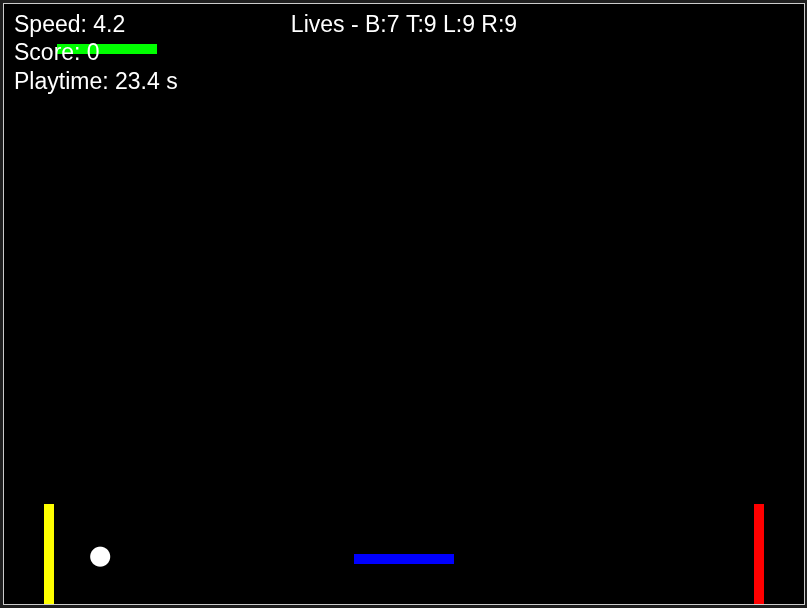

# js_retrobash

### Play it now: https://pemmyz.github.io/js_retrobash/


# 🔳 4-Way Paddle Ball Game

A fast-paced, arcade-style browser game with four paddles defending all edges of the screen! Inspired by Pong, but now the ball can come from *any* direction.

### Game


## 🎮 Gameplay

- Defend **all four sides**: Bottom, Top, Left, and Right.
- Each paddle has **9 lives**.
- Lose a life if the ball escapes past your paddle.
- Game Over when any paddle runs out of lives.

### Controls

#### 🔵 Bottom Paddle (Player)
- `←` / `→`: Move left and right  
- `Space`: Launch ball  
- `A`: Toggle Auto-Follow mode  
- `Arrow ↑ / ↓`: Increase/decrease ball speed  
- `N`: Restart game  
- `1`–`5`: Restart with 1 to 5 balls

#### 🤖 AI Paddles
- Top, Left, and Right paddles follow the ball automatically.

---

## 🧠 Features

- Responsive canvas using HTML5 and JavaScript
- Adjustable ball speed and multi-ball mode
- AI-controlled paddles on top, left, and right
- Smart paddle collision angles for realistic bounces
- Auto-follow mode for player-controlled paddle
- Dynamic lives counter and real-time playtime
- Game Over screen with restart instructions

---

## 🛠 Setup

No server needed. Just open the HTML file!

```bash
git clone https://github.com/pemmyz/js_retrobash.git
cd 4way-paddle-game
open index.html  # or just double-click
```
---

## 📌 To-Do / Ideas

- Add sound effects for bounces and game over  
- Add score system and leaderboard  
- Multiplayer support or touch controls for mobile  
- Powerups or difficulty scaling over time  
